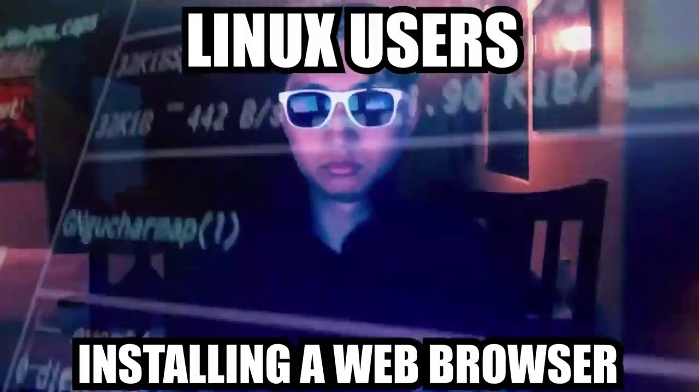

# Overview of the course

During this course you learn how to use the command line to control your computer (or remote ones). While most of the time we use our computer using an interface the same thing can also be done through writing commands in a terminal. Sure, this may not be as convenient as just clicking icons to execute, install or navigate through our files, hence the linux memes...



... But this opens up a load of applications and utilities. These applications go from automating small tasks or troubleshooting issues all the way to managing remote machines, servers and containers.

## Module 1: Introduction to Command Line Environments

This introduces the most basic concepts and commands, these being:

1. What is a **command line** and how to set it up? We can cite canonical (developers of Ubuntu distro) on this one: "*The Linux command line is a text interface to your computer*". This means you can send orders to your computer and receive responses. This can go as far as communicating with the kernel of the operative system, which is a computer program at the core of a computer's operating system that always has complete control over everything in the system.

2. Important **commands**:

    * Navigation: `ls`, `cd` and `pwd`

    * File managing: `mkdir`, `cp` and `mv`

    * Reading files: `cat` and `less`

    * Documentation system: `man` (probably the most important one)

    * Basic text processing: `head`, `tail`, `wc`, `uniq`, `sort` and `tr`

3. Terminal based **text editors**. More specifically `nano` although I personally prefer `Vim`.

4. **File size** and how they work, which is often overlooked as it's regarded as background knowledge.

5. What are **Linux and UNIX** and UNIX filesystem. Unix is a proprietary operating system that was developed in the seventies. Unix was written in the C programming language which meant that it could be easily ported to many hardware architectures. This is something that we take for granted nowadays but at that time operative systems were tightly linked to hardware. Linux is also an operative system developed under the same principles as UNIX during the 90s, this is why it's considered a UNIX-based OS. But the main difference is that Linux is completely open-source, meaning that its source code is freely available for modification and redistribution. This is why there are hundreds of versions of Linux.

Personally I was already familiar with most of the concepts presented during this module, as I have been using Linux as my main OS for almost two years now. During this week I mostly learned a different way to do some tasks, as I was previously using python for basic text processing.

## Module 2: Text Processing in UNIX

During this module we learn how to do some heavier text processing. This requires an introduction to character **encoding systems**, which are ways to convert the sequences of bits (a unit that can two values, usually depicted as 1 or 0) into characters. Bits are grouped in bytes, which contains 8 bits. One byte can store a number up to 256. The number represented by the byte can be linked to a specific character, thus one character occupies one byte of memory. As we need to represent more characters given that one might need to use several alphabetic systems we might need more space, so some character encodings use two bytes, which can represent up to 65,536 different characters. The most common character encoding systems are ASCII, which uses a 7-bit character encoding system, and UTF-8,  ranging from 1 to 4 bytes per character.

After this we get into **text processing** and the use of **regular expressions**. During this week **standard streams** (Standard input/output and error) are also introduced, which are preconnected input and output channels used in computer programming to facilitate communication between a program and its environment. For text processing two main command are used:

* `grep` is used to search for specific text patterns in files and print the matching lines.

* `sed` is a stream editor that can modify and transform text in files, such as substituting or deleting text.

Both of these command can use regular expressions, also abbreviated as regex. Regex is a system that uses specific sequences of characters to search for specific patterns of text. This means that it may not necessarily search for specific text, but rather for patterns such as words that end with a specific letter or set of letters. For example, let's say we want to search for all the dates (in dd/mm/yyyy format) in a text, we can use a regular expression that matches a pattern that is composed of two numbers followed by a slash, another two numbers followed by a slash and, finally, four numbers. This regex can be written in many ways, some are `\d\d/\d\d/\d\d\d\d` or `[0-9]{2}/[0-9]{2}/[0-9]{4}`. The command might look like: 

```bash
cat file.txt | grep -E '[0-9]{2}/[0-9]{2}/[0-9]{4}'
```

The command and the regex can be combined to search, for example, for all the lines in a document that contain dates or emails. This is very useful to search though logs of files. This has, personally, helped me while troubleshooting several issues. For example, once I had the problem that the computer remained powered on after lid was closed (it wasn't going to sleep) despite the screen being turned off. To troubleshoot the issue and find out what was happening I used the `grep` command piped with the systemd log (using the command `journalctl`) to search for all the logs related to the lid. This helped me to find the root of the issue and to solve it.

Besides this also some of the concepts introduced during this module were also familiar to me. I had previously used regular expressions extensively with python and python offers some features, such as positive/negative look behind/forward, that are not available while using the `grep` and `sed` commands (they are available using perl tho). Despite this the are still very powerful for some light to moderate text processing.

## Module 3: Scripting, Configuration Files and Installing Programs

The third module introduces scripting, environment variables, the root user and the package manager. **Scripting** means writing files with the commands you want to execute so that instead of writing the command one by one you can execute the script, which will execute the command written line by line. The script also make it easier to use control sequences such as conditional statements or loops. This allows a more efficient and detailed automation, as some scripts can get pretty complex and can even call and execute other scripts. An example of a script is the next:

```bash
#!/bin/bash
while read -r line;
do
    if [ "${line:${#line}-1:1}" = "y" ];then #gets the last char of the line and compares it
        echo $line | sed "s/y$/ier/g" # Note that using ${line:0:${#line}-1}"ier" might be more efficient
    else
        echo $line"er"
    fi
done < "$1"
```

This script receives a file as a parameter and reads it line by line. Each line is supposed to be an adjective so the script checks whether the line ends with the letter "y". If it does then replaces the "y" with "ier", otherwise just adds "er" at the end of the word, then in both cases the result is sent to the standard output, which means it's printed in the console.

Scripts and commands can also check and edit **environment variables**. The environment is an area that the shell builds every time that it starts a session that contains variables that define system properties. Processes and programs running in the computer can read these variables, which means they can affect how running processes behave on a computer. Some common environment variables are:


| Variable        | Description           | Example  |
| ------------- |:-------------:| -----:|
| `HOME`      | User's home directory | `/usr/local/sbin:/usr/local/bin:/usr/sbin:/usr/bin:/sbin:/bin` |
| `PATH`      | Directories to search for executables     |   `/home/username` |
| `USER` | The name of the currently logged-in user.      |    `ivan` |
| `PWD`  | The current working directory. | `/home/username/projects` |
| `OSTYPE`  | The operating system type. | `linux-gnu` |

These environmental variables can be read by using `echo $VARIABLENAME` but they can also be set using the command `export`. This command can also be used in conjunction with configuration files such as `~/.bashrc` to create or set environment variables when you open the shell or login into your user.

Finally the module introduces the package manager and the root user, which usually go together hand in hand, as you usually need root permissions to install packages. The **root user** is the most powerful account, granting unrestricted access to all files and commands on the system. This account is essential for system administration tasks, but it should be used cautiously to avoid potential security risks. While using a terminal you can activate the root user by typing the command `su`, but it's more common to just execute command by using `sudo`. The `sudo` command is followed by another command, which will be executed as the root user. A **package manager** in Linux is a software tool that automates the installation, updating, and removal of software packages on a Linux system. It manages dependencies and ensures that all necessary components are installed for software to function correctly.

Personally, this module helped me when grasping some key concepts I was familiar to me. For example, I was already familiar with the concept of environment variables but they seemed like magic to me. After this module it's clear what they are, how to read/set them and what are they used for. This module also improved my bash skills, as I had previously used bash only for commands and simple scripts but never with control sequences. Regarding the root user and the package managers, I was already familiar with such concept after using Linux for so long.

## Module 4: Using ssh, scp and Version Control

The main subjects of this module are Processes, remote servers and version control systems. A **process** is something that is under execution, this means that the program is active. This includes programs that are running in the foreground and in the background. Every process is assigned an ID (PID), a state, Input/Oputput information and CPU information. The PID of a process uniquely identifies it and it is assigned by the operative system. Processes can be listed and tracked by using the `ps` command and killed or stopped by using the `kill` command with the PID of the process. Commands can also be ran on the background by writing `&` at the end of the command.

The second subject of this module is the use of remote servers, specifically connecting to their terminal using SSH (Secure SHell) and transferring files between your local machine and the remote server using the `scp` command. The first step is to get a remote server that we can ssh into, in this course we used CSC remote servers. For the ssh to work you must generate an ssh key. This can be done using the following command:

```bash
ssh-keygen -a 100 -t ed25519
```

This command generates an ssh key of type ed25519 and hashes the key 100 times using bcrypt before it is used to encrypt the private key (the bigger the number the slower it gets but also more secure). The ssh is composed of a public key and a private key. The public key is stored in the computer you want to connect to and the private key should be securely stored into your computer, usually protected by a password that will be prompted when the key is used. When you try to ssh into the server containing the public key your private key is used to establish the connection securely. This is done by using the `ssh` command as:

```bash
ssh [username]@[hostname or IP of the server]
```

Once connected you can use the `scp` command to transfer files to/from the remote server as:

```bash
scp /path/to/source /path/to/destination
```

Note that the path of the remote server should have the ssh direction of the remote machine, for example:

```bash
scp /path/to/local/source username@remoteIP:/path/to/remote/destination
```

Finally the last concept introduced in this module is version control systems and remote repositories, more specifically git and GitHub. Note that these two are different things, git (meaning "global information tracker" or "goddamn idiotic truckload of sh*t", as you prefer) is a version control system that tracks changes to files, especially in software development projects, while GitHub is a cloud-based platform that allows developers to store, manage, and collaborate on code using version control. This means that git works on a local repository while GitHub manages the remote repository. Git is commonly used though a bash console, and some common command are:

* `git init`: Creates a repository in the current working directory.

* `git status`: Checks the status of the repository.

* `git add file`: Add file to tracking.

* `git commit -m "message"`: Commits the changes made, which is like a snapshot of the current state of the project, allowing you to restore the files back to this snapshot. The `-m` means a message is also passed describing the changes.

It is also possible to add a remote repository, which can be hosted in GitHub or in other pages such as GitLab or BitBucket, by using the `git remote add origin https://github.com/username/repo-name.git`. This makes working on a project with other developers easier. Files from the local repository are uploaded into the remote one by using the `git push` command. You can also update the files in your local repository to get the latest version of the project wit the `git pull` command. You can also create branches in your repository, which let you work on new features safely. Version control systems are an essential component of software development.

Personally, despite being already very familiar with version control systems, this module has been extremely useful. I had used git and GitHub previously but I never used the branching/merging system before this, I mostly stuck to a basic main branch structure. I find that managing and understanding processes is really important, specially when working with containers. And the most important part I think it was ssh and remote servers, as this is something that I have struggled to understand since I had to set up the ssh key to manage repos for the first time. And this goes even beyond GitHub as this allows me to set up my own home server and be able to connect to it securely.

## Final project

The final project consists on building your own personal webpage hosted in Github pages in a CV/resume-like format and adding some information about the course. This gives you the chance to have your own personal webpage while learning some things about web development. This project is built using Jekyll, which is a site generator that transforms plain text files written in Markdown into HTML websites. This means that you'll learn how to use Markdown, which is a lightweight markup language designed to format plain text in a way that is easy to read and write. Nonetheless you are also encouraged to edit the styles in the CSS files (or just write HTML and CSS in Markdown). You can also edit the HTML but in my experience it's a bit messy, as the next time that you bundle Jekyll the changes will be reverted. Editing the CSS files is fine, although you'll have to do some digging into the files of the template used. For example, I edited the */_sass/jekyll-theme-minimal.scss* to add some custom styles:

```css
header img {
  border: 6px solid rgb(0, 0, 0);
  border-radius: 35px 2px 35px 2px;
}
```

The code above is how I changed the style of every image that is inside the `<header>` label so it has a black border. I also added some radius to the top-left and bottom-right corners to make it a bit more stylized without breaking the aesthetic of the template.

The page should summarize the content of the course and show some of the code written, as well as serve as a personal page. As I already mentioned the page is hosted in GitHub pages, which is a static site hosting service that takes HTML, CSS, and JavaScript files straight from a repository on GitHub and publishes a website.

I think this page is a great way to present yourself, as you are both showing some of the skills learned and sharing it in a tidy and practical way. Markdown is extremely easy to learn and really useful when taking class notes, especially in subjects related to math, statistics and computer programming. This is because Jupyter notebooks uses markdown for the text cells, which allows you to combine code and notes in the same file. The markdown cells in the notebooks even let you use HTML/CSS and latex.