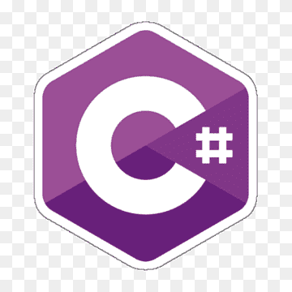
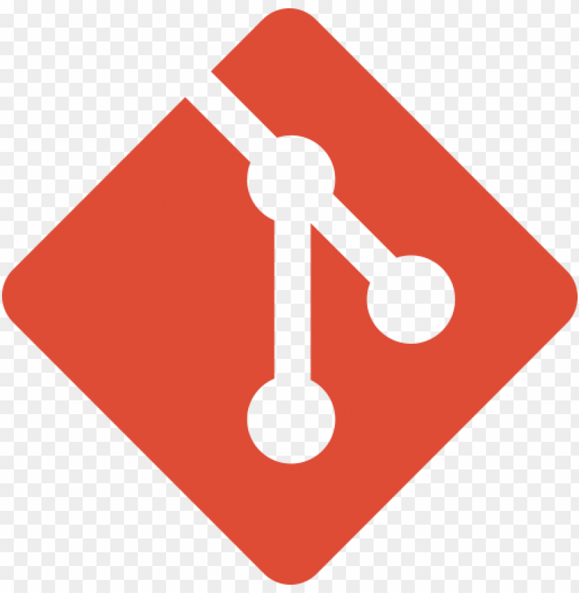

## Introduction

I’m a developer with a background in Computational Linguistics and Video Game Development, passionate about data, AI, and technology that connects language, people, and systems. I work primarily with Python (for data analysis, NLP, and machine learning) and SQL, I’m also proficient in C# for Unity and software development. In addition, I also have working knowledge of other languages such as C, JavaScript, Bash, HTML/CSS and other programming and scripting languages that support flexible problem-solving and automation.

My experience includes teaching Python and C#, developing machine learning models, and building tools that turn complex data into clear, usable insights. I’m skilled with frameworks and libraries such as Pandas, NumPy, Scikit-Learn, and Matplotlib, and I’m comfortable working with version control systems, like Git, and data formats like XML and JSON.

I speak English and Spanish fluently and am currently learning Finnish. I’m always looking to grow as a developer and data professional, especially in roles that bridge data engineering, AI, and intelligent systems.

## Projects

### [TFG-IvanMontejoDeGarcini](https://github.com/IvanInRainbows/TFG-IvanMontejoDeGarcini)

This is the repository used to store all the code used in the process of making my Bachelor's thesis (Trabajo de fin de grado) for the applied linguistics degree in the Complutense University of Madrid. The aim of the thesis is to help discerning texts that have been generated by language models from those which have been written by humans. This project focuses specifically on detecting reviews in Spanish generated by the language model gpt-4. A more specific objective of the thesis is to determine relevant linguistic features that characterise AI-generated and human-generated texts and to create a prototype that can be used for this purpose using Python and machine-learning libraries.

The subject of this thesis is motivated by the fact that AI-generated text and language have been a growing concern during the last years. This has been especially true in academic environments, where there has been several cases of assignments entirely created by AI. These are difficult to detect due to the lack accurate tools.

### [TrabajoFinalHipermedia.github.io](https://github.com/IvanInRainbows/TrabajoFinalHipermedia.github.io)

The repository for the final project of the Hypermedia technologies (Tecnologías hipermedia) course taken in the Complutense University of madrid made using HTML, CSS and JavaScript. The page is also [published](TrabajoFinalHipermedia.github.io) in Github pages. It's not working properly tho, it should have some fancy dynamic vector background.

### [cmdline-course](https://github.com/IvanInRainbows/cmdline-course)

Sample repository made for the [Command-Line Tools for Linguists](https://studies.helsinki.fi/kurssit/toteutus/hy-opt-cur-2526-261401a1-c550-4436-91b9-7edf4a1a3b57/KIK-LG221) course. Shows how git repositories work, how files change and how the repository is branched.

### [WordAnalyzerApp](https://github.com/IvanInRainbows/WordAnalyzerApp)

A desktop application built in python tkinter using wordnet libraries to analyze words in different levels and languages.

## Programming languages

<table class="tg"><thead>
  <tr>
    <th class="tg-0lax">Language</th>
    <th class="tg-0lax">Level</th>
    <th class="tg-0lax"></th>
  </tr></thead>
<tbody>
  <tr>
    <td class="tg-0lax">Python</td>
    <td class="tg-0lax">
        

            

        

    </td>
    <td class="tg-0lax"></td>
  </tr>
  <tr>
    <td class="tg-0lax">SQL</td>
    <td class="tg-0lax">
        

            

        

    </td>
    <td class="tg-0lax"></td>
  </tr>
  <tr>
    <td class="tg-0lax">C#</td>
    <td class="tg-0lax">
        

            

        

    </td>
    <td class="tg-0lax"></td>
  </tr>
  <tr>
    <td class="tg-0lax">Bash</td>
    <td class="tg-0lax">
        

            

        

    </td>
    <td class="tg-0lax"></td>
  </tr>
  <tr>
    <td class="tg-0lax">HTML/CSS</td>
    <td class="tg-0lax">
        

            

        

    </td>
    <td class="tg-0lax"></td>
  </tr>
  <tr>
    <td class="tg-0lax">JavaScript</td>
    <td class="tg-0lax">
        

            

        

    </td>
    <td class="tg-0lax"></td>
  </tr>
  <tr>
    <td class="tg-0lax">C</td>
    <td class="tg-0lax">
        

            

        

    </td>
    <td class="tg-0lax"></td>
  </tr>
</tbody>
</table>

## Software

<table class="tg"><thead>
  <tr>
    <th class="tg-0lax">Name</th>
    <th class="tg-0lax">Level</th>
    <th class="tg-0lax"></th>
  </tr></thead>
<tbody>
    <tr>
        <td class="tg-0lax">git</td>
        <td class="tg-0lax">Advanced</td>
        <td class="tg-0lax"></td>
  </tr>
  <tr>
    <td class="tg-0lax">Unity3D</td>
    <td class="tg-0lax">Advanced</td>
    <td class="tg-0lax"></td>
  </tr>
  <tr>
    <td class="tg-0lax">Excel</td>
    <td class="tg-0lax">Intermediate</td>
    <td class="tg-0lax"></td>
  </tr>
  <tr>
    <td class="tg-0lax">Photoshop</td>
    <td class="tg-0lax">Advanced</td>
    <td class="tg-0lax"></td>
  </tr>
</tbody>
</table>

## Education

<h3 style="margin-bottom: 0px;">University Of Helsinki</h3>
Master's degree, Language technology 
2025-2027

<h3 style="margin-bottom: 0px;">Complutense university of Madrid</h3>
University degree, Computational linguistics 
2021-2025 
Graduated with honors in Databases and Computational linguistics

<h3 style="margin-bottom: 0px;">CEV Madrid</h3>
High national degree, 3D and Video-game development 
2015-2017

## Courses I've Taken in the University of Helsinki

[Command-Line Tools for Linguists](https://studies.helsinki.fi/kurssit/toteutus/hy-opt-cur-2526-261401a1-c550-4436-91b9-7edf4a1a3b57/KIK-LG221), fall 2025

[Programming for Digital Humanities](https://studies.helsinki.fi/kurssit/toteutus/hy-opt-cur-2526-d85cca5c-0a41-4332-9f2b-5f8d82d602c9/LDA-H511), fall 2025

[Introduction to Linguistic Diversity and Digital Humanities](https://studies.helsinki.fi/kurssit/toteutus/hy-opt-cur-2526-9df97501-21e6-4b8d-9de4-e91303f2ff71/LDA-301), fall 2025

[Suomi 2A](https://studies.helsinki.fi/courses/course-implementation/hy-opt-cur-2526-ca10c16c-a048-430b-9ded-071b58cd8502/SUO-121), fall 2025

## Find me on

[LinkedIn](https://www.linkedin.com/in/ivan-montejo-76a806110/en/), [GitHub](https://github.com/IvanInRainbows/)

## Contact

My email address is of the form ivan.montejodegarcini@helsinki.fi. 

## Misc. 

Check out my [CV](https://www.overleaf.com/read/tyvbmmkpkczv#110a05) 
